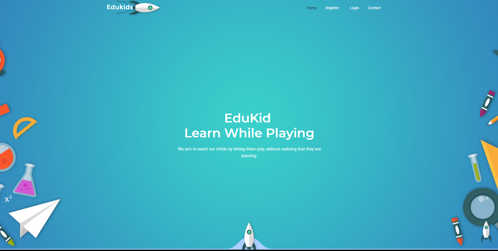

<p align="center">
  <a href="https://github.com/othneildrew/Best-README-Template">
    
  </a>

  <h3 align="center">EduKids</h3>

  <p align="center">
    An awesome website to LEARN through PLAYING
    
  </p>
</p>


<!-- TABLE OF CONTENTS -->
## Table of Contents

* [About the Project](#about-the-project)
  * [Built With](#built-with)
* [Getting Started](#getting-started)
  * [Prerequisites](#prerequisites)
  * [Installation](#installation)
* [Usage](#usage)
* [Contributing](#contributing)


<!-- ABOUT THE PROJECT -->
## About The Project


EduKids is an educational website that targets the kids within the ages (4-8), We noticed that the traditinal way of teaching is not that effective
so we designed EduKids.
EdeKids, a perfect way for perants so they can monitor there kids strengths and weaknesses while they are only playing.
In EduKids we are targeting the inner mind of our kids by leting them play, and counting on there actions on the game we are evaluating them based on an international studies that look after this topic.  


why EduKids:
* To build a better and a smart generation that will lead us to a better future.
* A site where parents can count on and trust their children with.
* A site where our kids can play non-stop


### Built With
This section should list any major frameworks that you built your project using. Leave any add-ons/plugins for the acknowledgements section. Here are a few examples.
* Frontend
  * [React](https://reactjs.org/)
  * [axios](https://www.npmjs.com/package/axios)
  * [firebase](https://firebase.google.com/)
  * [Bootstrap](https://getbootstrap.com)
  * [react-awesome-modal](https://www.npmjs.com/package/react-awesome-modal)
  * [react-card-flip](https://www.npmjs.com/package/react-card-flip)
  * [react-router-dom](https://www.npmjs.com/package/react-router-dom)
  * [react-minimal-pie-chart](https://www.npmjs.com/package/react-minimal-pie-chart)
  * [react-toastifyreact-toastify](https://www.npmjs.com/package/react-toastify)
* Backend
  * [python](https://www.python.org/)
  * [Django](https://www.djangoproject.com/)
  * [django rest framework](https://www.django-rest-framework.org/)
  * [django-rest-knox](https://james1345.github.io/django-rest-knox/installation/)
  * [mysqlclient](https://pypi.org/project/mysqlclient/)
  * [free-mysql-hosting](https://remotemysql.com/)
  * [heroku](https://www.heroku.com/)
  * [django-Testcase](https://docs.djangoproject.com/en/2.2/topics/testing/overview/)


<!-- GETTING STARTED -->
## Getting Started

This is an example of how you may give instructions on setting up your project locally.
To get a local copy up and running follow these simple example steps.

### Prerequisites

This is an example of how to list things you need to use the software and how to install them.
* NodeJS
* python
* npm
```sh
npm install npm@latest -g
```


### Installation

1. Clone the repo
```sh
git clone https://github.com/cleancode200/KidsEdu
```
2. Install NPM packages
```sh
npm install
```
3. Install the PIP requiements
```sh
pip install requirements.txt
```

<!-- USAGE EXAMPLES -->
## Usage

* [flipgame](https://github.com/cleancode200/KidsEdu/blob/master/back/frontend/src/flipgame.js) 

This file cne be used in many categoris, what we did here is that we created a one component that can be uses as a many components at the same time, so we are rendering all the levels and all the subCatigores in one component and thats called reusability, so insted of creating a hundreds of components we only created one that do the job of hunderds   .


<!-- CONTRIBUTING -->
## Contributing

Contributions are what make the open source community such an amazing place to be learn, inspire, and create. Any contributions you make are **greatly appreciated**.

1. Fork the Project
  * Fork this repository by clicking on the fork button on the top of this page. This will create a copy of this repository in your account.
2. Clone the repository
  * Now clone the forked repository to your machine. Go to your GitHub account, open the forked repository, click on the clone button and then click the copy to clipboard icon.
  * Open a terminal and run the following git command:
 ```sh
git clone "url you just copied"
```
3. Create your Branch
  * Now create a branch using the git checkout command:
 (`The name of the branch does not need to have the word add in it, but it's a reasonable thing to include because the purpose of this branch is to add your name to a list`)
  ```sh
  git checkout -b {add_your_new_branch_name}
  ```
4. Commit your Changes 
  * after you finish from your adjustments ==> in your terminal 
```sh
git status
```
```sh
git add .
```
```sh
git commit -m "Add your commit here"
```
  
5. Push to the GitHub 
  * Push your changes using the command `git push`:
```sh
git commit -m "Add your commit here"
```
6. Open a Pull Request
  * If you go to your repository on GitHub, you'll see a Compare & pull request button. on the right side
  * press on it and (`submit the pull request`)


